# 🍔 FoodExpress - Online Food Delivery System

A full-stack responsive food delivery web app built with **Laravel 11, Bootstrap 5, MySQL & JavaScript**.

## ✨ What Makes It Different
- 🤖 **AI Food Mood Bot** — suggests food based on how you feel
- 📊 **Weekly Health Grade** — A/B/C/D based on your eating habits  
- 🔥 **Calorie Budget Tracker** — real-time bar as you add items to cart
- 🌙 **Time-Based Menus** — changes greeting based on time of day
- ♻️ **Eco-Friendly Badges** — highlights green restaurants
- 🔍 **Ingredient Transparency** — "What's Inside?" for every dish

## 🛠️ Built With
`Laravel 11` `Bootstrap 5` `MySQL` `JavaScript` `RESTful APIs` `PHP`

## 📋 Features
- Browse 10+ restaurants with menus and nutritional info
- Add to cart with real-time calorie tracking
- Place orders with delivery address
- Dashboard with health stats and order history
- Secure login & registration

---

## 🎥 Project Demo


▶️ **Watch the complete project demonstration**

[📹 View Demo Video](https://github.com/sarashafique225/Online-Food-Delivery-System/blob/main/DemoVideo/FoodExpressDemo.mp4)

---

## 📸 Project Screenshots

### 🏠 Homepage
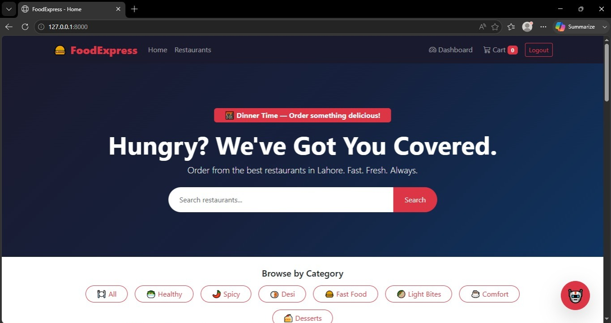

### 👤 Registration
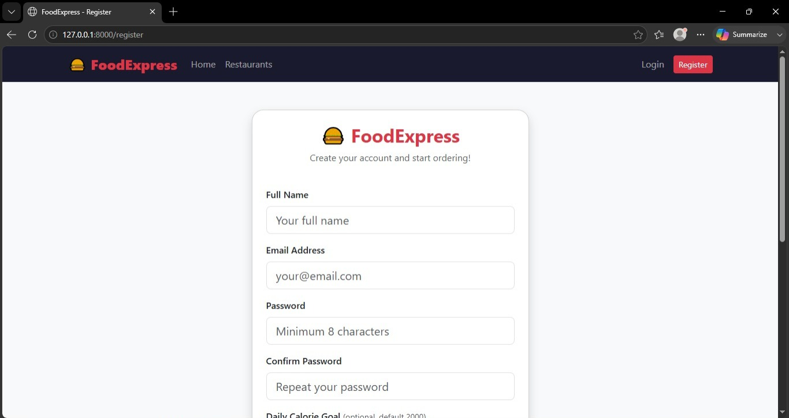

### 🔐 Login
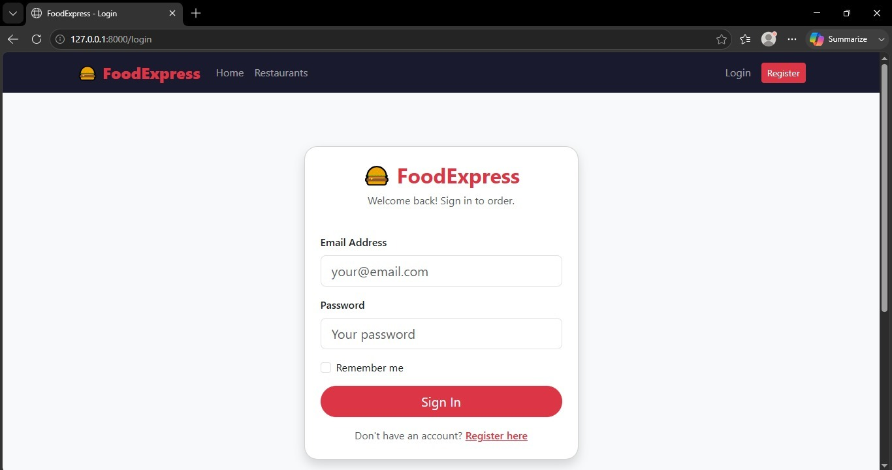

### 📊 Dashboard
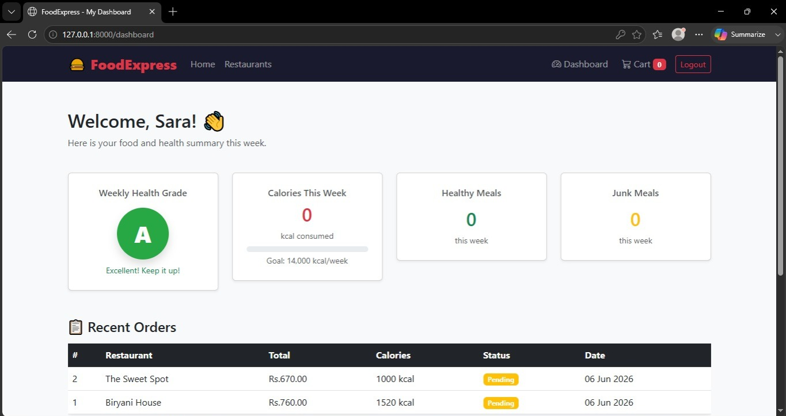

### 🍽 Restaurants Overview
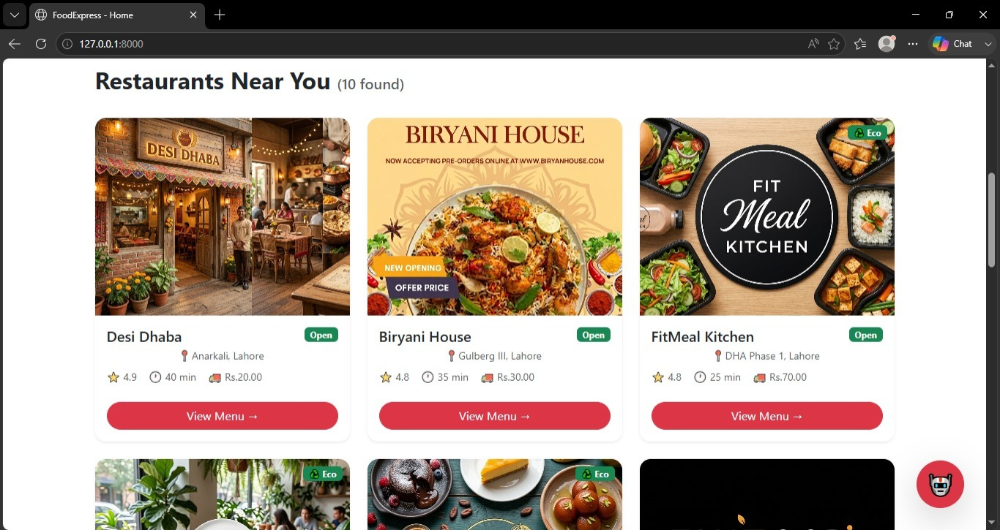

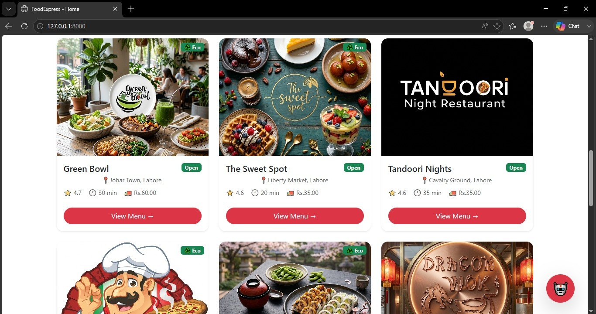

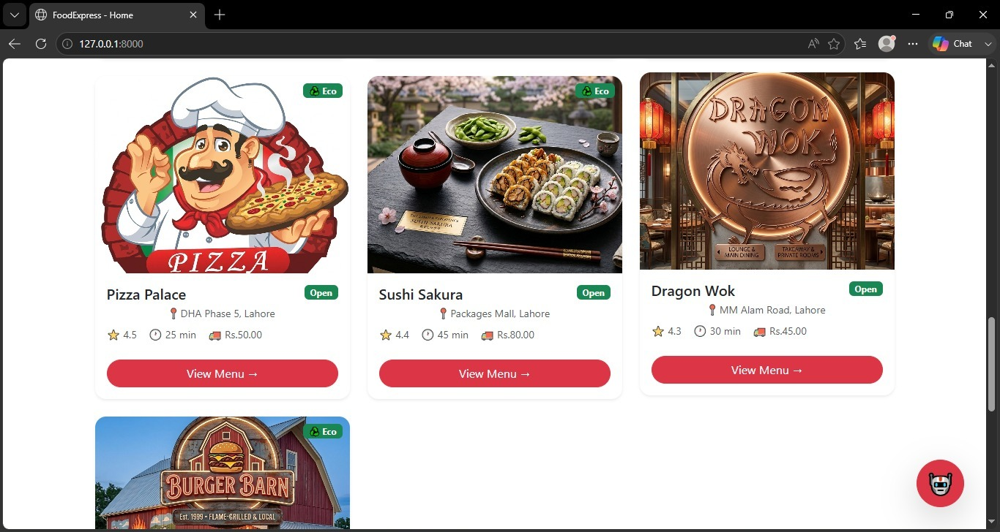

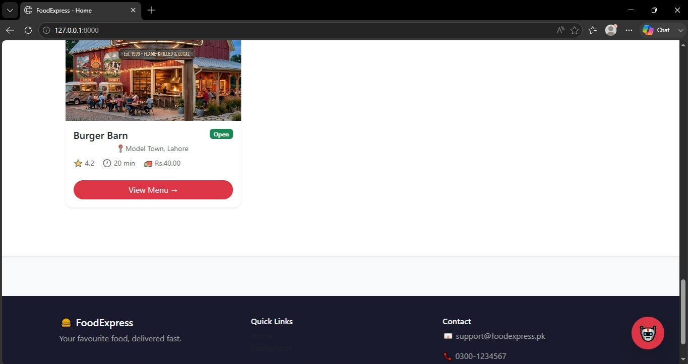

### 📋 Restaurant Details
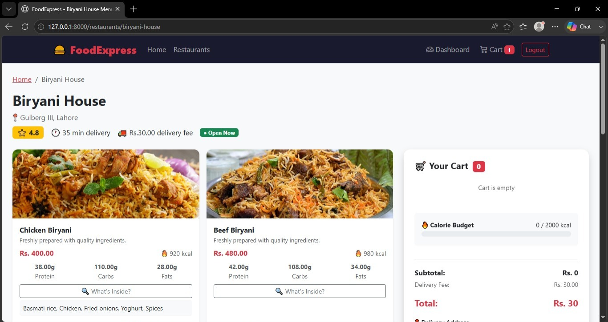

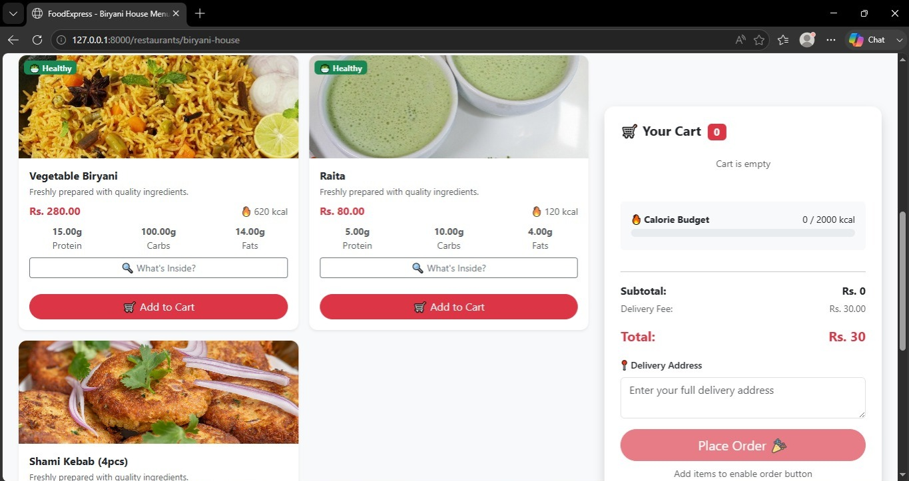

### 🤖 AI Food Mood Bot
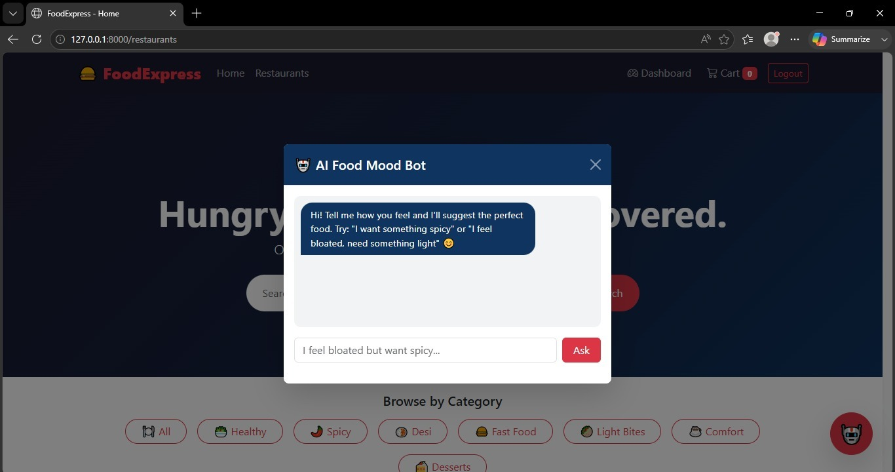

### 🛒 Shopping Cart
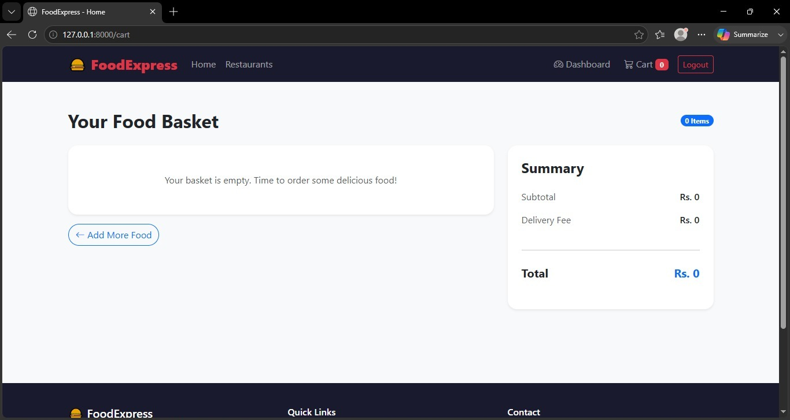

## 🚀 Installation
```bash
git clone https://github.com/sarashafique225/Online-Food-Delivery-System.git
cd Online-Food-Delivery-System
composer install
cp .env.example .env
php artisan key:generate
php artisan migrate
php artisan db:seed --class=RestaurantSeeder
php artisan db:seed --class=FoodItemSeeder
php artisan serve
```

## 👥 Developed By
**Sara Shafiq**
